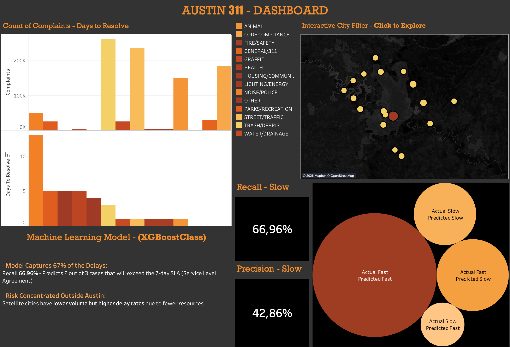

# 📊 Austin 311 Service Requests Analysis

An end-to-end data analytics project using **BigQuery, SQL, Python, Machine Learning, and Tableau** 
to analyze public service requests from the city of Austin.

---

## Overview

In this project, I explored the **Austin 311 Service Requests** dataset to better understand operational patterns, 
resolution times, and complaint behavior.

The workflow included:

- extracting and cleaning data with **BigQuery + SQL**
- preprocessing and analysis with **Python & Pandas**
- building a **Machine Learning model**
- creating an interactive **Tableau dashboard**

The main goal was to predict whether a service request would be resolved **quickly or slowly** based on historical patterns.

---

# 🛠 Tech Stack

| Tool | Purpose |
|---|---|
| Google BigQuery | Data extraction & SQL processing |
| SQL | Data cleaning and filtering |
| Python | Analysis & Machine Learning |
| Pandas | Data manipulation |
| Matplotlib / Seaborn | Visualizations |
| Scikit-Learn | ML utilities |
| XGBoost | Classification model |
| Tableau | Dashboard & storytelling |

---

# ☁️ BigQuery & SQL

The original dataset was processed inside **Google Cloud BigQuery**.

Using SQL, I:

- filtered unnecessary columns
- reduced dataset size
- optimized the data for analysis
- exported a cleaner dataset (~137 MB)

---

## BigQuery Screenshot


---

# 🐍 Data Cleaning & Processing

After exporting the data, I used **Python and Pandas** to clean and organize the dataset.

### Main preprocessing steps:

- datetime conversion
- city name standardization
- missing value handling
- outlier removal
- complaint categorization
- feature engineering

Some city names were highly inconsistent, for example:

```python
AUSTINhttps:/
aUSTIN
AUSTIN4413 WHI
```

These values were standardized into cleaner categories.

---

## Complaint Categorization

The dataset originally contained more than **255 complaint descriptions**.

To improve analysis and model performance, I grouped them into broader categories such as:

- 🚧 STREET/TRAFFIC
- 💧 WATER/DRAINAGE
- 🗑 TRASH/DEBRIS
- 🐶 ANIMAL
- 🌳 PARKS/RECREATION
- 🚨 NOISE/POLICE
- ⚡ LIGHTING/ENERGY

---

# 📈 Exploratory Data Analysis

One of the main analyses focused on understanding which complaint categories took longer to resolve.

## Average Resolution Time

| Category | Avg. Days to Resolve |
|---|---|
| GENERAL/311 | 0.26 |
| STREET/TRAFFIC | 5.27 |
| WATER/DRAINAGE | 6.99 |
| GRAFFITI | 15.11 |
| TRASH/DEBRIS | 17.71 |
| NOISE/POLICE | 18.72 |

---

# 🤖 Machine Learning Model

I built a classification model to predict whether a request would be:

- **Fast** → resolved within 7 days
- **Slow** → resolved after 7 days

---

## Features Used

The model used features such as:

- city
- complaint category
- month
- weekday
- hour

---

## Model

```python
XGBClassifier()
```

---

## Performance

| Metric | Score |
|---|---|
| ROC AUC | 0.785 |
| Recall (Slow Cases) | 67% |
| Precision (Slow Cases) | 43% |

### Interpretation

The model was able to rank delayed cases above fast cases about **78.5% of the time**.

I adjusted the classification threshold to prioritize identifying delayed requests since, operationally:

- false positives are cheaper
- false negatives are more costly

---

# 📊 Tableau Dashboard

To finish the project, I created an interactive dashboard in Tableau to visualize complaint behavior and operational trends.

---

## Dashboard Link

🔗 [View Dashboard Here](https://public.tableau.com/app/profile/breno.zamponi/viz/Austin_331/DASH)

---

## Dashboard Screenshot



---

# 💡 Key Insights

- Trash and debris complaints had some of the highest resolution times
- Noise and police-related requests were frequently delayed
- General 311 requests were resolved very quickly
- Complaint category had a strong impact on resolution speed
- Temporal patterns (hour, weekday, month) helped improve predictions

---

# 👩‍💻 Author

### Breno Larocerie Zamponi

Data Analytics • Machine Learning • Business Intelligence

- [LinkedIn](https://www.linkedin.com/in/breno-zamponi-b3bb2a2aa/)

---
